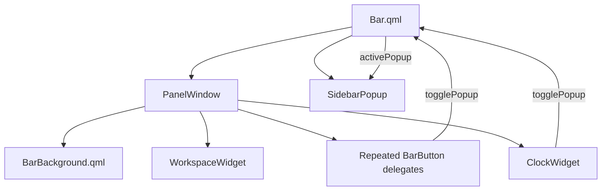

# Main bar refactor

This document describes the structural cleanup of `Bar.qml` and the supporting changes to the bar background, buttons, and sidebar popup.

## Goals

The refactor was intended to make the main bar easier to read and safer to reuse without changing its appearance or its theme and network bindings. It aims to:

- separate custom background drawing from bar composition;
- make popup coordination explicit;
- remove unused and misleading declarations;
- reduce repeated button configuration;
- handle a missing configured monitor gracefully; and
- preserve the existing getter-based theme and network bindings.

## Component structure

Before the refactor, `Bar.qml` owned popup state, monitor selection, custom shape paths, layout, and every individual button declaration. The custom drawing now lives in `BarBackground.qml`, while `Bar.qml` remains responsible for composition and coordination.



## `Bar.qml`

`Bar.qml` remains the owner of the active popup and exposes three operations:

```qml
showPopup(popupName)
togglePopup(popupName)
closePopup()
```

These operations validate popup names against `PopupSourcesMap` before changing `activePopup`. The IPC handler and clickable bar controls use the same controller rather than implementing separate toggle logic.

The existing bindings were deliberately preserved:

```qml
property var theme: ThemeManager.getCurTheme()
property string networkType: NetworkManager.getConnectionType()
```

This refactor does not change how theme or network state is obtained.

## Explicit popup coordination

Previously, `BarButtonBase.qml` and `SidebarPopup.qml` referred to `activePopup` through their surrounding QML scope. That made both components dependent on being instantiated beneath an object with a property of that exact name.

Both components now receive the owner explicitly through `popupController`:

```qml
popupController: root
```

Buttons request a popup change through the controller:

```qml
root.popupController.togglePopup(root.popupName)
```

The sidebar observes the same controller:

```qml
property string requestedPopup: popupController.activePopup
```

This makes the dependency visible at each call site and keeps popup-name validation centralized in `Bar.qml`.

## `BarBackground.qml`

The three-piece bar background was extracted into `widgets/BarBackground.qml`. It owns:

- the full-width upper section;
- the curved slim middle section;
- the full-width lower section; and
- the geometry used to anchor the sidebar popup.

The parent supplies the spacer boundaries and visual parameters:

```qml
BarBackground {
    anchors.fill: parent
    spacerTop: barContent.spacerTop
    spacerBottom: barContent.spacerBottom
    backgroundColor: root.theme.backgroundColor
    fullWidth: barPanel.fullBarWidth
    slimWidth: barPanel.slimBarWidth
}
```

The extracted component exposes `middleInnerEdgeX` and `middleCenterY`, allowing the popup to remain aligned with the narrow middle section without duplicating its geometry in `Bar.qml`.

## Repeated status buttons

The system statistics, network, audio, and Bluetooth buttons previously repeated the same layout, font, and color bindings. They are now generated from a small model:

```qml
model: ["systemStats", "network", "audio", "bluetooth"]
```

The network entry keeps its dynamic connection-type icon. Other entries obtain their icon from their popup name:

```qml
labelIcon: iconsMap.map[popupName === "network" ? root.networkType : popupName]
```

The clock remains explicit because its pill layout and colors differ from the standard icon buttons.

## Button alignment

The icon `Text` in `BarButton.qml` is now centered within its `20 × 30` button item:

```qml
anchors.centerIn: parent
```

This prevents icons with different glyph widths from being positioned from the item's upper-left corner.

## Monitor fallback and sizing

The preferred monitor is still selected through `ScreensMap`, but the first available screen is now used when the configured monitor is unavailable:

```qml
screen: Quickshell.screens.find(s => s.name === screensMap.map["monitor1"])
    ?? Quickshell.screens[0]
```

The explicit `implicitHeight: screen.height` binding was removed because the `PanelWindow` is already anchored to the top and bottom of its screen. This also avoids directly dereferencing a missing screen during initialization.

The panel remains 40 pixels wide. Its upper and lower sections use that full width, so the refactor does not change the panel's exclusion or input region. Any change to that behavior should be treated as a separate layout decision.

## Cleanup

The refactor also removed:

- an unused required `modelData` property on the `PanelWindow`;
- unused `Quickshell.Wayland`, `Quickshell.Widgets`, and `QtQuick.Shapes` imports from `Bar.qml`; and
- stale commented-out popup styling assignments.

`QtQuick.Shapes` is now imported only by `BarBackground.qml`, where the shape types are used.

## Files involved

| File | Responsibility |
| --- | --- |
| `Bar.qml` | Owns popup state, panel composition, screen selection, and widget theme wiring |
| `widgets/BarBackground.qml` | Draws the three-piece bar and exposes popup anchor geometry |
| `generics/BarButtonBase.qml` | Handles button interaction and delegates popup requests to its controller |
| `generics/BarButton.qml` | Renders and centers a standard status icon |
| `generics/SidebarPopup.qml` | Observes popup state through its explicit controller |

## Verification

The running Quickshell configuration hot-reloaded successfully after the changes. Popup open and close operations were exercised through the existing IPC handler, and the final runtime log contained no new QML errors.

## Result

`Bar.qml` now reads primarily as a description of the bar: workspace controls at the top, flexible space in the middle, status controls and the clock at the bottom, plus one coordinated sidebar popup. Custom shape drawing is isolated, repeated button declarations are data-driven, popup dependencies are explicit, and the original visual and state-binding choices remain intact.
