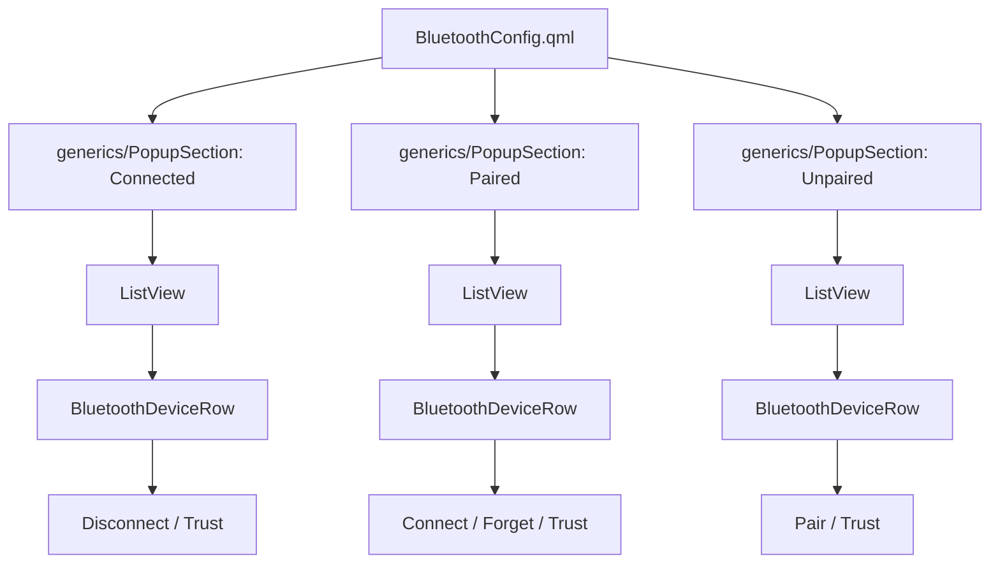
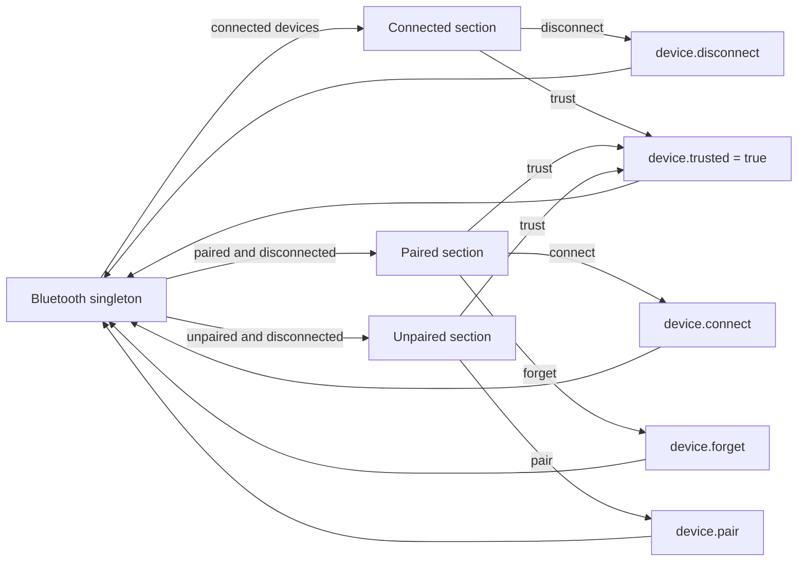
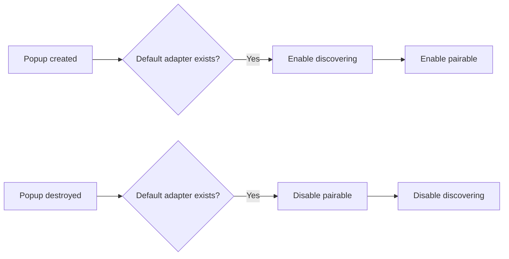

# Bluetooth popup UI refactor

This document describes the UI organization changes made to `BluetoothConfig.qml` and the supporting `BluetoothDeviceRow.qml` component.

## Goals

The refactor was intended to make the Bluetooth popup easier to read, extend, and maintain while preserving its existing responsibilities:

- show connected devices;
- show paired but disconnected devices;
- show nearby unpaired devices;
- connect, disconnect, pair, forget, and trust devices; and
- enable discovery and pairing while the popup exists.

The main design change was to turn `BluetoothConfig.qml` into a high-level composition of sections and delegates instead of keeping headings, scrolling behavior, device rows, and every action button in one file.

## Component structure

The original popup used nested `Repeater`, `Column`, `Flickable`, and `Row` components for all three device categories. The refactored popup uses the shared collapsible section component and one reusable device-row delegate.



### `BluetoothConfig.qml`

`BluetoothConfig.qml` now owns the overall popup structure and shared sizing values:

- popup width;
- standard row height;
- maximum height for each device list;
- the Connected, Paired, and Unpaired sections;
- device filtering and sorting; and
- adapter discovery and pairing lifecycle.

It uses `ColumnLayout` and `Layout.fillWidth` rather than calculating most sizes from `childrenRect`. This provides a predictable popup width and lets each child participate in the layout normally.

The popup-specific row component and shared generic components are imported through explicit namespaces:

```qml
import "." as PopupComponents
import "../../generics" as Generics
```

The popup also displays **No Bluetooth adapter found** when Quickshell reports no available adapter.

### `../../generics/PopupSection.qml`

The same `PopupSection` introduced for the network popup is now used for Bluetooth. Each section provides:

- an expansion arrow;
- a category title;
- the current device count; and
- a collapsible content area.

Each section owns one `expanded` Boolean instead of manually changing both a `Flickable`'s visibility and height.

### `BluetoothDeviceRow.qml`

This component displays a device name and the actions appropriate for its category. Its required `category` property determines which controls are visible:

| Category | Actions |
| --- | --- |
| Connected | Disconnect, Trust when needed |
| Paired | Connect, Forget, Trust when needed |
| Unpaired | Pair, Trust when needed |

The device name receives the flexible portion of the row and is elided when it is too long. Action buttons use predictable widths and the shared popup row height.

## Data flow

Quickshell's `Bluetooth` singleton remains the source of adapter and device state. The popup derives three lists from `Bluetooth.devices.values` and passes each device to `BluetoothDeviceRow`.



Quickshell updates the source device collection after an action. The filtered lists and section counts then update from that state.

## Device grouping and sorting

Devices are divided into three mutually exclusive groups:

```text
Connected: device.connected
Paired:    device.paired && !device.connected
Unpaired:  !device.paired && !device.connected
```

Each group is sorted alphabetically by device name. Names that look like Bluetooth MAC addresses are placed after friendly names so recognizable devices remain easier to find. The MAC-address check accepts both colon-separated and hyphen-separated addresses.

Each `ListView` grows naturally for short lists and is capped at 250 pixels. Longer lists become scrollable instead of making the entire popup excessively tall.

## Discovery lifecycle

The previous popup enabled discovery and pairing when it was created and disabled them when it was destroyed. That behavior is preserved:



Adapter access remains guarded because `Bluetooth.defaultAdapter` may be absent.

## Problems found during integration

### Delegate category scope

The first implementation generated all three sections from a JavaScript array and attempted to pass each outer section's category into its nested `ListView` delegate. The running Quickshell instance reported that an undefined value was being assigned to a required string property because the nested delegate's `modelData` shadowed the outer delegate's `modelData`.

The final version declares the three sections explicitly and passes literal category values:

```qml
category: "connected"
category: "paired"
category: "unpaired"
```

This keeps delegate data unambiguous and makes the actions available in each section immediately visible in `BluetoothConfig.qml`.

### Component location

The Bluetooth popup now lives in its own `bluetooth/` directory, matching the network popup structure. `PopupSourcesMap.qml` was updated from:

```text
../popups/BluetoothConfig.qml
```

to:

```text
../popups/bluetooth/BluetoothConfig.qml
```

A popup that was already open may need to be closed and reopened for the running Quickshell instance to load the new component path.

## Files involved

| File | Responsibility |
| --- | --- |
| `BluetoothConfig.qml` | Composes the popup, groups devices, and manages discovery lifecycle |
| `BluetoothDeviceRow.qml` | Displays a device and its category-specific actions |
| `../../generics/PopupSection.qml` | Shared collapsible heading and content container |
| `../../util/PopupSourcesMap.qml` | Points the Bluetooth popup source to its new location |

## Result

The Bluetooth popup now follows the same organization as the network popup. Its main component describes the interface at a high level, device-row behavior lives in a named component, every category is independently collapsible, list height is bounded, and the existing Bluetooth actions and discovery behavior are preserved.
