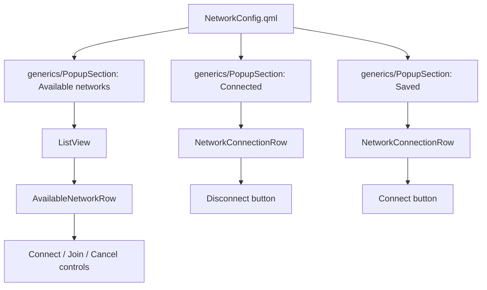
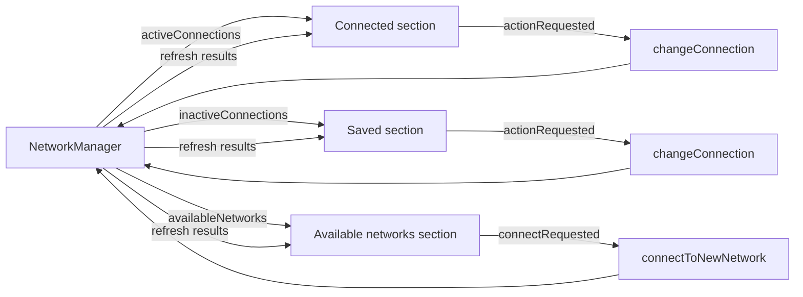
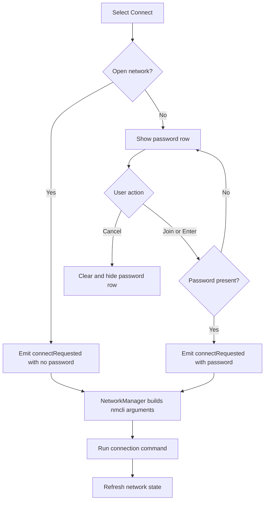

# Network popup UI refactor

This document describes the UI organization changes made to `NetworkConfig.qml` and the small supporting change made to `NetworkManager.qml`.

## Goals

The refactor was intended to make the network popup easier to read, extend, and maintain while preserving its existing responsibilities:

- show connected connections;
- show saved but inactive connections;
- show nearby Wi-Fi networks;
- connect and disconnect saved connections; and
- connect to open or password-protected Wi-Fi networks.

The main design change was to turn `NetworkConfig.qml` into a high-level composition of sections and delegates instead of keeping every UI detail in one file.

## Component structure

The original popup contained its headings, repeated rows, scrolling logic, buttons, and password input in one component. The refactored popup delegates those responsibilities to three reusable components.



### `NetworkConfig.qml`

`NetworkConfig.qml` now owns the overall popup structure and shared sizing values:

- popup width;
- standard row height;
- maximum available-network list height;
- the three network sections; and
- calls into `NetworkManager` in response to row signals.

It uses `ColumnLayout` and `Layout.fillWidth` rather than calculating most sizes from `childrenRect`. This creates one predictable width for the popup and lets child components participate in layout normally.

The popup-specific row components and shared generic components are imported through explicit namespaces:

```qml
import "." as PopupComponents
import "../generics" as Generics
```

This was necessary because the running Quickshell component scanner did not reliably resolve all newly created component types through an implicit directory import.

### `../generics/PopupSection.qml`

`PopupSection` provides a consistent collapsible section that can be shared by network, Bluetooth, and other popup UIs. It includes:

- an expansion arrow;
- a title;
- an item count; and
- a content area.

It exposes the content area as its default property, so callers can place a `Repeater` or `ListView` directly inside it. Each section keeps a single `expanded` Boolean as the source of truth instead of independently changing both `visible` and `height`.

### `NetworkConnectionRow.qml`

This component represents both connected and saved connections. Its `connected` property determines whether the action is labeled **Disconnect** or **Connect**.

The shared row gives connection names flexible space, elides names that are too long, and reserves predictable space for the connection icon and action button.

### `AvailableNetworkRow.qml`

This component displays:

- the SSID;
- security type;
- signal bars; and
- connection controls.

Password entry expands into a separate row, which avoids squeezing the SSID, security status, signal, button, and input field into one horizontal line. Password text is masked with `TextInput.Password`.

Open networks connect immediately. Secured networks first reveal the password field and provide **Join** and **Cancel** actions.

## Data flow

`NetworkManager` remains the source of network state. The popup divides its data into three visual sections and delegates user actions back to the manager.



Available networks that are already in use are filtered out because they are represented in the Connected section.

The available-network `ListView` is capped at 250 pixels. It grows naturally when only a few networks exist and becomes scrollable when the list would otherwise make the popup excessively tall.

## Wi-Fi connection flow



## `NetworkManager.qml` correction

The previous Wi-Fi command construction always included a password and appended the interface incorrectly:

```text
nmcli dev wifi connect <ssid> password <password> <interface> <undefined wlan0 variable>
```

The refactored command is assembled conditionally:

```text
Secured: nmcli dev wifi connect <ssid> password <password> ifname <interface>
Open:    nmcli dev wifi connect <ssid> ifname <interface>
```

This fixes three issues:

1. `wlan0` was referenced as an undefined JavaScript variable.
2. `nmcli` requires the `ifname` keyword before the interface value.
3. Open networks must not receive a password argument.

The manager now refreshes the network data after a successful Wi-Fi connection command completes.

## Problems found during integration

### New component discovery

Quickshell hot reload initially reported `PopupSection is not a type`, and later `AvailableNetworkRow is not a type`. A full restart was required for newly created QML files to be discovered. The explicit `PopupComponents` namespace also made local component resolution reliable.

### Missing repeater data

The connected and saved rows initially rendered without connection information. The runtime log showed:

```text
ReferenceError: modelData is not defined
TypeError: Cannot read property 'name' of undefined
```

After extracting the delegate into its own component, QML required the delegate instance to declare `modelData` explicitly:

```qml
required property var modelData
```

That declaration allows `Repeater` to inject the current model item before it is assigned to the row's `connection` property.

### Section header layout warning

The first section header placed an anchored `MouseArea` directly inside a `RowLayout`. Qt warns that anchoring an item managed by a layout has undefined behavior. The header is now wrapped in an `Item`; its internal row and click area can safely use anchors without competing with the parent layout.

## Files involved

| File | Responsibility |
| --- | --- |
| `NetworkConfig.qml` | Composes the popup and connects UI signals to the manager |
| `../generics/PopupSection.qml` | Shared collapsible heading and content container |
| `NetworkConnectionRow.qml` | Shared connected/saved connection delegate |
| `AvailableNetworkRow.qml` | Available Wi-Fi delegate and password interaction |
| `../global/NetworkManager.qml` | Network state, `nmcli` commands, and refresh behavior |

## Result

The main popup now reads as a description of the interface rather than a collection of low-level controls. Repeated behavior lives in named components, list height is bounded, columns have predictable space, section state is centralized, and open and secured Wi-Fi networks follow distinct connection flows.
