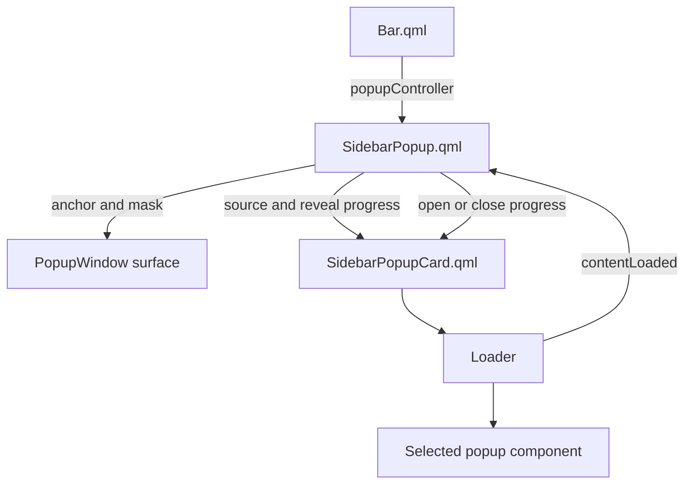
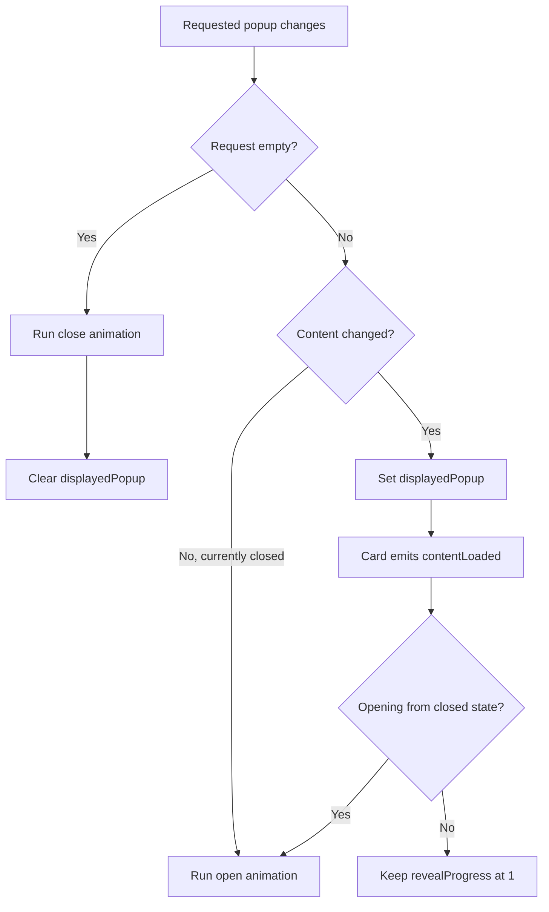

# Sidebar popup refactor

This document describes the separation of popup-window state from the visual popup card previously implemented together in `SidebarPopup.qml`.

## Goals

The refactor was intended to give the native popup window and its visual content distinct responsibilities while preserving the existing popup behavior. It aims to:

- keep window anchoring and popup lifecycle state in `SidebarPopup.qml`;
- move card shape, sizing, clipping, and presentation into a dedicated component;
- make shared visual measurements configurable through named properties;
- remove unused animation state and no-op transforms; and
- simplify the open and close animation declarations.

## Component structure

Before the refactor, `SidebarPopup.qml` contained the native `PopupWindow`, anchor calculations, input mask, card rectangle, dynamic loader, reveal transform, size animations, and popup-switching state machine.

The visual portion now lives in `SidebarPopupCard.qml`:



## `SidebarPopup.qml`

`SidebarPopup.qml` remains responsible for behavior tied to the native popup surface:

- anchoring the popup to the bar;
- maintaining a stable Wayland surface size;
- limiting pointer input to the visible card;
- observing the requested popup through `popupController`;
- retaining the displayed popup while it closes;
- sequencing content loading with the reveal animation; and
- clearing the displayed popup after the close animation finishes.

The window continues to distinguish between the popup requested by the controller and the popup currently loaded into the card:

```qml
property string requestedPopup: popupController.activePopup
property string displayedPopup: ""
```

This distinction allows the current content to remain visible during its closing animation. Setting `displayedPopup` to an empty string immediately would unload the content before the card finishes moving offscreen.

## `SidebarPopupCard.qml`

The extracted card component owns the popup's visual presentation:

- maximum-size constrained width and height;
- background color and left-side corner radii;
- content padding and clipping;
- dynamic popup loading;
- animated size changes; and
- horizontal reveal translation.

The parent supplies the current source and presentation state:

```qml
SidebarPopupCard {
    contentSource: popupSources.map[popup.displayedPopup] || ""
    maximumWidth: popup.width
    maximumHeight: popup.height
    revealProgress: popup.revealProgress
    color: popup.backgroundColor
}
```

The card calculates its size from the loaded component while respecting the native window bounds:

```qml
width: Math.min(maximumWidth, popupLoader.implicitWidth + contentPadding * 2)
height: Math.min(maximumHeight, popupLoader.implicitHeight + contentPadding * 2)
```

Keeping the native window size stable while changing only the card size avoids recreating or continuously resizing the Wayland popup surface.

## Content-loading lifecycle

The `Loader` is owned by `SidebarPopupCard`, but popup sequencing remains owned by `SidebarPopup`. The card emits `contentLoaded()` after its loader finishes:

```qml
onLoaded: root.contentLoaded()
```

The parent handles that notification through `handleContentLoaded()`. If the popup is opening from a closed state, it starts the reveal animation. If the card is already open and only its content changed, it remains fully revealed.



## Reveal presentation

The card uses a normalized `revealProgress` value:

| Value | Appearance |
| --- | --- |
| `0` | Card translated completely outside the popup surface |
| `1` | Card in its final visible position |

The card converts that state into a horizontal translation:

```qml
x: (1 - root.revealProgress) * root.width
```

This keeps the state machine independent from the card's current width, including while different popup contents cause its size to animate.

## Named presentation properties

Previously, padding, radius, and animation duration appeared as repeated numeric literals. `SidebarPopup` now exposes them as named properties and supplies them to the card:

```qml
property int contentPadding: 15
property int cornerRadius: 16
property int animationDuration: 300
```

These properties keep the defaults unchanged while making future visual adjustments explicit and localized.

## Animation cleanup

The open and close animations were previously wrapped in `ParallelAnimation` objects even though each wrapper contained only one `NumberAnimation`. They are now direct animations targeting `revealProgress`.

The refactor also removed:

- the unused `verticalRevealProgress` property;
- a `Scale` transform with no scale value and therefore no visual effect; and
- the extra transform list that was only needed to hold that no-op scale.

The loading callback was renamed from `finishLoadingPopup()` to `handleContentLoaded()` to describe the event it handles rather than implying that it controls the loader itself.

## Files involved

| File | Responsibility |
| --- | --- |
| `modules/generics/SidebarPopup.qml` | Owns the native window, anchoring, input mask, popup identity, and transition lifecycle |
| `modules/generics/SidebarPopupCard.qml` | Owns visual shape, content framing, dynamic loading, size animation, and reveal presentation |
| `modules/Bar.qml` | Supplies the popup controller and bar-relative anchor coordinates |
| `modules/util/PopupSourcesMap.qml` | Maps popup names to dynamically loaded QML sources |

## Verification

The running Quickshell configuration reloaded successfully after the extraction. The theme changer popup was opened and closed through the existing IPC handler, and no new QML errors appeared in the runtime log. `git diff --check` also completed successfully.

## Result

`SidebarPopup.qml` now reads as a popup lifecycle controller rather than a mixture of window management and rectangle implementation details. `SidebarPopupCard.qml` contains the visual presentation behind a small property-and-signal interface, while popup switching, load sequencing, and close cleanup remain together where they can be understood as one state transition flow.
