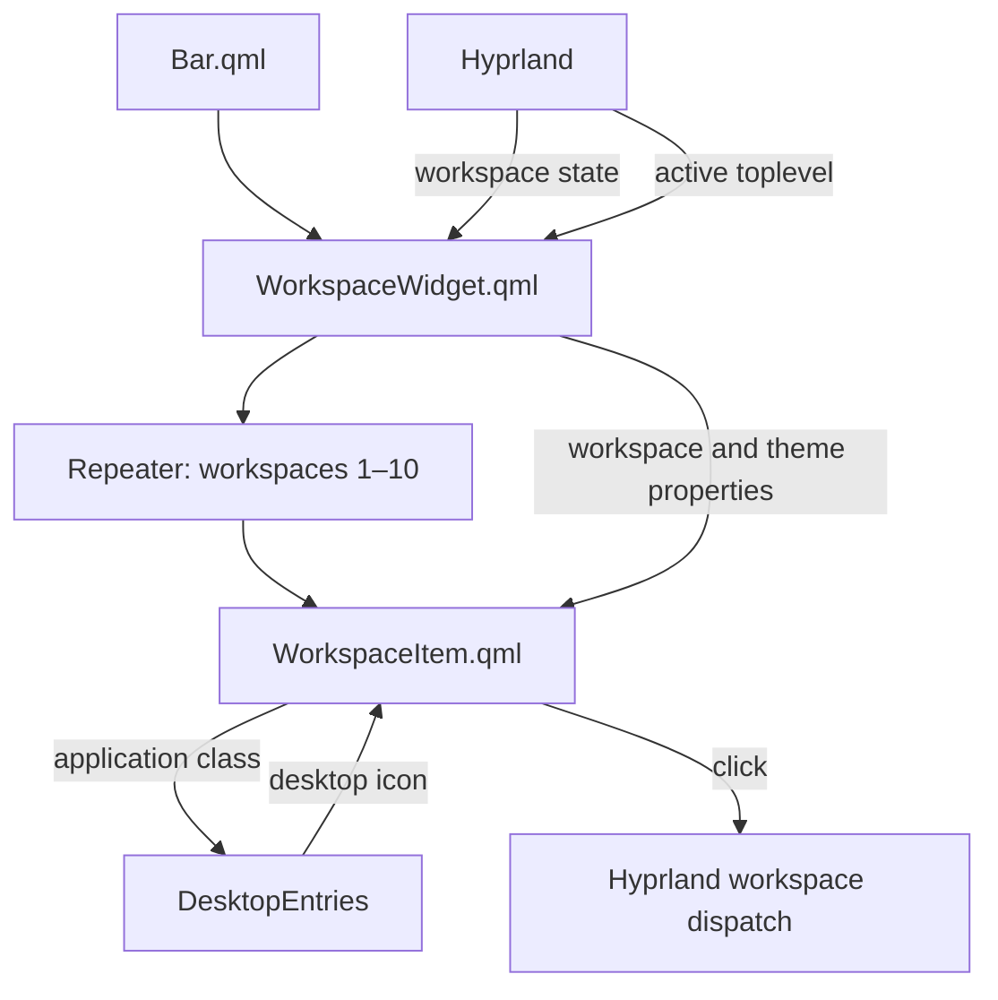
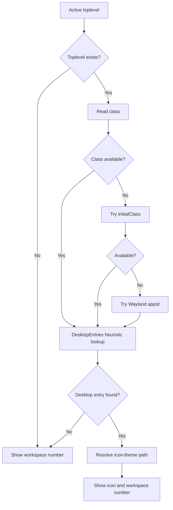

# Workspace widget refactor

This document describes the workspace widget refactor and the addition of focused-application icons.

## Goals

The refactor was intended to add useful application context without turning the workspace indicator into a taskbar. It also separates collection-level behavior from the presentation of an individual workspace.

The widget now aims to:

- preserve the familiar workspace numbers;
- distinguish empty, occupied, and active workspaces through theme colors;
- show the focused application's icon on the active workspace;
- fall back cleanly when an application icon cannot be resolved; and
- keep each QML component focused on one responsibility.

## Component structure

The original `WorkspaceWidget.qml` contained the workspace repeater, state lookup, icon resolution, visual layout, animation, and click handling in one file. The refactored version uses a parent widget and a dedicated delegate.



The components live together in a dedicated directory, while this design note is kept with the project's other refactor documentation:

```text
widgets/workspace/
├── WorkspaceWidget.qml
└── WorkspaceItem.qml

designNotes/
└── WorkspaceWidget-Refactor.md
```

`Bar.qml` imports `widgets/workspace` so `WorkspaceWidget` remains directly available to the bar.

## `WorkspaceWidget.qml`

`WorkspaceWidget.qml` owns the workspace collection and theme wiring. It creates ten `WorkspaceItem` delegates and supplies each one with:

- its workspace ID;
- the matching Hyprland workspace object, when one exists;
- whether it is the focused workspace;
- the active Hyprland toplevel for the focused workspace; and
- the active, occupied, empty, font, and outline theme values.

The workspace ID is derived from the repeater index:

```qml
workspaceId: index + 1
```

The corresponding Hyprland workspace is found by ID:

```qml
workspace: Hyprland.workspaces.values.find(item => item.id === workspaceId)
```

Only the active workspace receives `Hyprland.activeToplevel`. Inactive delegates receive `null`, so they remain simple numbered indicators.

## `WorkspaceItem.qml`

`WorkspaceItem.qml` owns the presentation and behavior of one workspace. Its responsibilities include:

- resolving the focused application's icon;
- displaying the icon and workspace number;
- selecting the correct theme color;
- animating between numbered and icon layouts; and
- dispatching workspace changes when clicked.

This keeps the parent component readable as a description of the workspace collection rather than a collection of low-level controls.

## Workspace states

Each item displays a number, including `0` for workspace 10. Its text color communicates state:

| State | Appearance |
| --- | --- |
| Active | Active theme color and focused application icon when available |
| Occupied | Occupied theme color and workspace number |
| Empty | Empty theme color and workspace number |

The active workspace does not use a border or background box. The icon, number sizing, and active text color provide the visual emphasis without adding extra weight to the bar.

## Application-icon resolution

The active Hyprland toplevel exposes application metadata through `lastIpcObject` and its Wayland handle. The delegate checks the available identifiers in this order:

```text
class → initialClass → Wayland appId
```

The first available identifier is passed to Quickshell's desktop-entry lookup:

```qml
const entry = DesktopEntries.heuristicLookup(appId)
```

When a matching desktop entry exists, its icon is resolved through the current system icon theme:

```qml
Quickshell.iconPath(entry.icon, "application-x-executable")
```

The generic application icon acts as the icon-theme fallback. If there is no application identifier or no desktop-entry match, the resolver returns an empty string and the workspace continues to display only its number.



## Layout and animation

An inactive workspace uses a compact `22 × 22` implicit size. When the active workspace has an application icon, it expands to `34 × 38` and places the icon above the smaller workspace number.

```text
Inactive or unresolved active workspace:  [ 2 ]

Active workspace with application icon:   [icon]
                                           [ 2 ]
```

The implicit width and height changes use short `NumberAnimation`s. This softens the layout change when focus moves between workspaces without introducing a continuous or distracting animation.

Full-color application icons are preserved. Theme matching comes from the active workspace number and the surrounding bar rather than applying a uniform tint that could make different applications difficult to recognize.

## Workspace switching

Each `WorkspaceItem` contains its own click target. Clicking it dispatches the selected workspace ID through Hyprland:

```qml
Hyprland.dispatch('hl.dsp.focus({ workspace = "' + workspaceId + '" })')
```

After Hyprland changes focus, its focused workspace and active toplevel properties update. Those changes flow back into the parent and delegate bindings automatically.

## Files involved

| File | Responsibility |
| --- | --- |
| `WorkspaceWidget.qml` | Creates the workspace collection and supplies state and theme properties |
| `WorkspaceItem.qml` | Renders one workspace, resolves its icon, and handles interaction |
| `../../Bar.qml` | Imports the workspace component directory and supplies theme values |

## Result

The workspace widget now preserves numbered navigation while adding focused-application context to the active workspace. The parent component handles collection state, the delegate handles one workspace's presentation, missing icons degrade gracefully, and the active state remains visually lightweight without a surrounding box.
